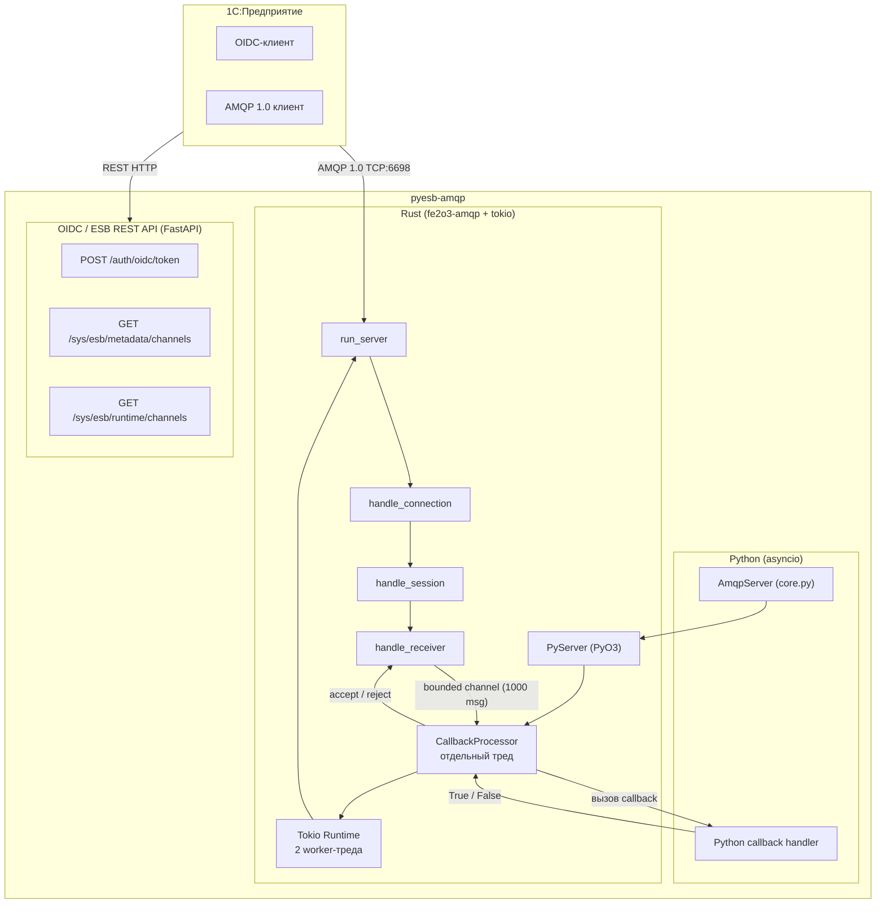
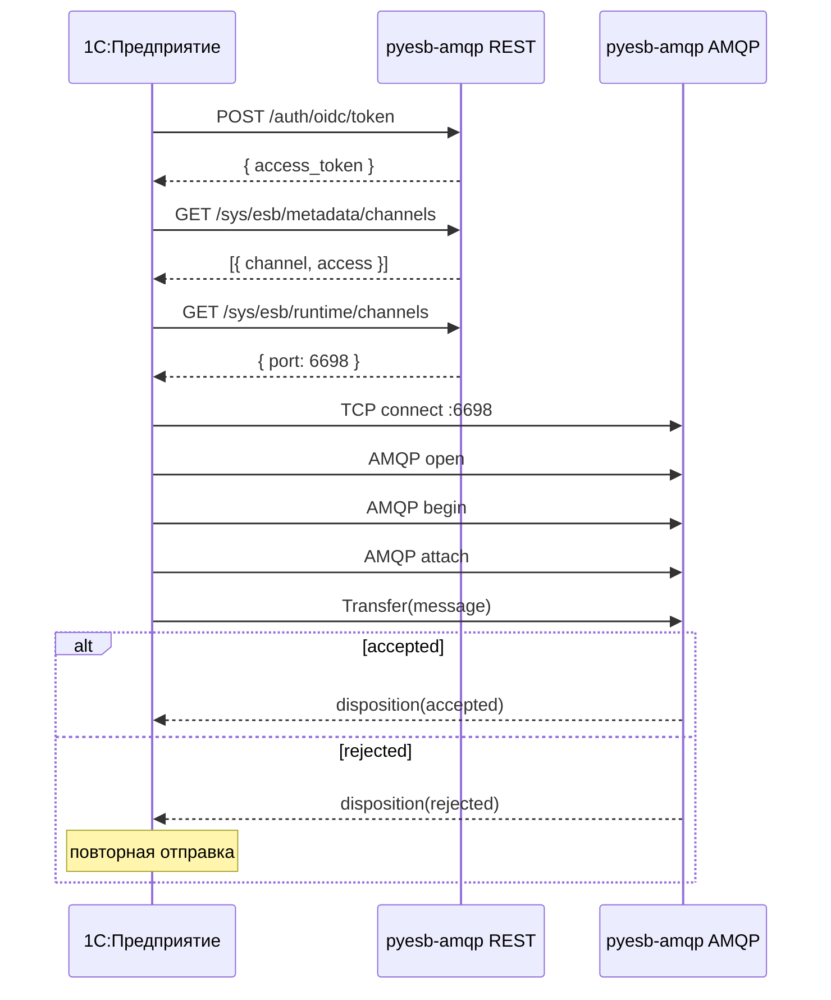

# pyesb-amqp

**Python-реализация 1С:Шины (ESB)** на базе AMQP 1.0.

Высокопроизводительный сервер-приёмник сообщений, написанный на Rust (fe2o3-amqp + tokio) с Python-обёрткой (PyO3). Предназначен для интеграции с платформой 1С:Предприятие через стандартный протокол AMQP 1.0 и REST-эндпоинты OIDC/ESB.

---

## Содержание

- [Архитектура](#архитектура)
- [Как это работает](#как-это-работает)
- [Установка](#установка)
- [Использование](#использование)
  - [Базовый asyncio](#базовый-asyncio)
  - [FastAPI lifespan](#fastapi-lifespan)
  - [Callback](#callback)
- [Python API](#python-api)
  - [AmqpServer](#amqpserver)
  - [AmqpMessage](#amqpmessage)
  - [AmqpMessageHandler](#amqpmessagehandler)
- [REST API для 1С](#rest-api-для-1с)
  - [OIDC токен](#oidc-токен)
  - [Метаданные каналов](#метаданные-каналов)
  - [Runtime информация](#runtime-информация)
- [Внутреннее устройство](#внутреннее-устройство)
  - [Потоки и concurrency](#потоки-и-concurrency)
  - [Очередь сообщений](#очередь-сообщений)
  - [Таймауты](#таймауты)
  - [Тело сообщения](#тело-сообщения)
- [Интеграция с 1С](#интеграция-с-1с)
- [Разработка](#разработка)
- [CI и сборка](#ci-и-сборка)
- [Лицензия](#лицензия)

---

## Архитектура



**Назначение**: pyesb-amqp — это компонент **1С:Шины** (Enterprise Service Bus), реализованный на Python. Он принимает AMQP 1.0-сообщения от 1С и передаёт их в Python-обработчик. Решение «accept/reject» возвращается обратно — 1С видит статус обработки.

---

## Как это работает

1. **1С** подключается к серверу pyesb-amqp по протоколу **AMQP 1.0** (порт `6698`).
2. Сервер акцептирует соединение, сессию и линк.
3. Для каждого полученного сообщения (`Delivery`) создаётся задача и ставится в bounded-канал.
4. **CallbackProcessor** (отдельный тред) забирает задачу, конвертирует в Python-объект и вызывает пользовательский колбэк.
5. Результат (`True`/`False`) возвращается через oneshot-канал обратно в tokio-тред.
6. Tokio-тред отправляет `accept` или `reject` обратно отправителю.
7. В случае `reject` 1С перешлёт сообщение повторно (при стандартных настройках).
8. Если колбэк бросил исключение — сервер логирует ошибку и отвечает `reject`.

---

## Установка

```bash
pip install pyesb-amqp
```

Требуется **Python ≥ 3.13**, зависимости: `fastapi`, `pydantic`.

---

## Использование

### Базовый asyncio

```python
import asyncio
from pyesb_amqp import AmqpServer, AmqpMessage


async def handle(msg: AmqpMessage) -> bool:
    print(f"Получено: {msg.body}")
    return True  # accept


async def main():
    async with AmqpServer(host="0.0.0.0", port=6698) as server:
        await server.start(handle)
        await asyncio.Event().wait()  # работаем вечно


asyncio.run(main())
```

### FastAPI lifespan

```python
from contextlib import asynccontextmanager
from fastapi import FastAPI
from pyesb_amqp import AmqpServer
from pyesb_amqp.oidc import router as esb_router

amqp = AmqpServer()


async def handle(msg):
    print(f"Сообщение: {msg.body}")
    return True  # accept — False = reject (повторная доставка)


@asynccontextmanager
async def lifespan(app: FastAPI):
    await amqp.start(handle)
    yield
    await amqp.stop()


app = FastAPI(lifespan=lifespan)
app.include_router(esb_router)


@app.get("/health")
async def health():
    return {"status": "ok"}
```

### Callback

```python
async def handler(msg: AmqpMessage) -> bool:
    ...
```

- **`True`** — сообщение принято (`accepted`)
- **`False`** — сообщение отклонено (`rejected`), удалённая сторона перешлёт повторно
- **Исключение в callback** — сервер ловит, логирует и отвечает `reject`

---

## Python API

### AmqpServer

```python
class AmqpServer:
    def __init__(
        self,
        host: str = "0.0.0.0",
        port: int = 6698,
        container_id: str = "pyesb-broker",
    ) -> None: ...
```

| Параметр       | Тип   | По умолчанию     | Описание                      |
| -------------- | ----- | ---------------- | ----------------------------- |
| `host`         | `str` | `"0.0.0.0"`      | Адрес для приёма соединений   |
| `port`         | `int` | `6698`           | TCP-порт AMQP 1.0 сервера     |
| `container_id` | `str` | `"pyesb-broker"` | Идентификатор контейнера AMQP |

**Методы**:

- `async start(handler: AmqpMessageHandler) -> None` — запустить сервер и зарегистрировать обработчик.
- `async stop() -> None` — остановить сервер (безопасно вызывать многократно).

**Контекстный менеджер**:

```python
async with AmqpServer() as server:
    await server.start(handler)
```

### AmqpMessage

Протокол (PEP 544) AMQP-сообщения:

```python
class AmqpMessage(Protocol):
    id: str          # Delivery tag (hex)
    body: bytes      # Тело сообщения
    properties: dict[str, str]  # AMQP application properties
    durable: bool    # Флаг долговечности
    priority: int    # Приоритет (0–255)
```

### AmqpMessageHandler

Протокол для асинхронного обработчика:

```python
class AmqpMessageHandler(Protocol):
    async def __call__(self, msg: AmqpMessage) -> bool: ...
```

---

## REST API для 1С

Модуль `pyesb_amqp.oidc` предоставляет REST-эндпоинты (FastAPI) для интеграции с 1С в формате 1С:Шины.

Подключение:

```python
from fastapi import FastAPI
from pyesb_amqp.oidc import router as esb_router

app = FastAPI()
app.include_router(esb_router)
```

### OIDC токен

```
POST /auth/oidc/token
```

Возвращает заглушку токена (реальная аутентификация не реализована):

```json
{
  "id_token": null,
  "access_token": "Not implemented",
  "token_type": "Bearer"
}
```

### Метаданные каналов

```
GET /sys/esb/metadata/channels
```

Список доступных каналов шины:

```json
[
  {
    "process": "pyesb",
    "processDescription": "DeadSnake.app",
    "channel": "outgoing",
    "channelDescription": "FlyAway",
    "access": "WRITE_ONLY"
  }
]
```

### Runtime информация

```
GET /sys/esb/runtime/channels
```

Информация о работающих каналах и порте подключения:

```json
{
  "items": [
    {
      "process": "pyesb",
      "channel": "outgoing",
      "destination": "queue"
    }
  ],
  "port": 6698
}
```

### E1CMessage

Модель сообщения, которое 1С отправляет через шину (для REST-эндпоинтов):

```python
class E1CMessage(BaseModel):
    id: UUID                  # Идентификатор сообщения
    durable: bool             # Флаг долговечности
    priority: NonNegativeInt  # Приоритет (0+)
    properties: dict[str, str]  # Произвольные свойства
    body: str                 # Тело сообщения (строка, JSON)
```

> **Отличие от AmqpMessage**: в AMQP-канале (порт 6698) тело сообщения передаётся как `bytes`, а в REST-модели `E1CMessage.body` — `str`, так как это JSON-сериализованные данные от 1С.

---

## Внутреннее устройство

### Потоки и concurrency

Сервер использует три уровня параллелизма:

| Тред / Runtime           | Назначение                                          | Кол-во потоков    |
| ------------------------ | --------------------------------------------------- | ----------------- |
| **Tokio runtime**        | AMQP listener, connection/session/receiver handlers | 2 worker-треда    |
| **CallbackProcessor**    | Вызов Python-колбэков (с захватом GIL)              | 1 выделенный тред |
| **Основной Python тред** | asyncio event loop (передаётся ссылка в Rust)       | 1                 |

Такой подход гарантирует, что **ни один tokio worker никогда не блокируется на Python-коде** — GIL удерживается только в CallbackProcessor.

### Очередь сообщений

- **Bounded канал** (mpsc) на **1000 сообщений** между tokio и CallbackProcessor.
- Когда очередь полна — `send()` блокируется, AMQP receive loop приостанавливается → **flow control** автоматически тормозит отправителя (1С).
- Предотвращает бесконечное накопление памяти при медленном обработчике.

### Таймауты

- **30 секунд** — максимальное время выполнения Python-хендлера.
- Если хендлер не ответил за 30 секунд — сервер отвечает `reject`.
- Если `oneshot` канал был закрыт без ответа — также `reject`.

### Тело сообщения

Поддерживаемые форматы AMQP body:

| Тип тела         | Обработка                                     |
| ---------------- | --------------------------------------------- |
| `Body::Data`     | Собираются все бинарные секции в один `bytes` |
| `Body::Value`    | AMQP Value сериализуется в JSON (`bytes`)     |
| `Body::Sequence` | AMQP Sequence сериализуется в JSON (`bytes`)  |
| `Body::Empty`    | Пустой `bytes`                                |

Application properties конвертируются в `dict[str, str]`:

- `String` / `Symbol` — как есть
- `Binary` — через `UTF-8 lossy`
- `Null` — пустая строка
- Остальные типы — через JSON

---

## Интеграция с 1С

Для подключения 1С:Предприятия к pyesb-amqp:

1. **REST API** — 1С получает OIDC токен и метаданные каналов через HTTP-эндпоинты (обычно на порту 8080 через FastAPI).
2. **AMQP 1.0** — на основе полученных метаданных 1С подключается к порту `6698` (или кастомному) по протоколу AMQP 1.0 и отправляет сообщения.
3. **Accept/Reject** — каждое сообщение требует подтверждения. `Accepted` — сообщение доставлено, `Rejected` — будет повторная попытка.

**Типичная последовательность:**



---

## Разработка

```bash
git clone https://github.com/lifesnap/pyesb-amqp
cd pyesb-amqp
uv venv
source .venv/bin/activate
maturin develop --uv
```

Зависимости разработки:

- **Rust** (edition 2021) — через rustup
- **Python** ≥ 3.13 — через uv или pyenv
- **maturin** — сборка Rust→Python
- **pytest** (по желанию) — для тестов

### Структура проекта

```
pyesb-amqp/
├── Cargo.toml                   # Rust-зависимости и мета
├── pyproject.toml               # Python-мета, maturin конфиг
├── src/
│   ├── lib.rs                   # Rust/PyO3 — AMQP сервер
│   └── pyesb_amqp/              # Python-обёртка
│       ├── __init__.py          # Публичное API
│       ├── core.py              # AmqpServer — asyncio-обёртка
│       ├── proto.py             # AmqpMessage, AmqpMessageHandler
│       ├── amqp.cpython-*.so    # Скомпилированное Rust-ядро
│       ├── py.typed             # PEP 561 — typed package
│       └── oidc/                # REST API для 1С
│           ├── __init__.py
│           ├── core.py          # FastAPI router + эндпоинты
│           └── models.py        # Pydantic-модели
└── .github/workflows/CI.yml     # GitHub Actions (maturin)
```

## CI и сборка

GitHub Actions автоматически собирает wheels для:

- **Linux**: x86_64, x86, aarch64, armv7, s390x, ppc64le (manylinux + musllinux)
- **Windows**: x64, x86, arm64
- **macOS**: x86_64, aarch64

Сборка через [maturin](https://www.maturin.rs/), публикация в PyPI по тегам.

---

## Лицензия

MIT
