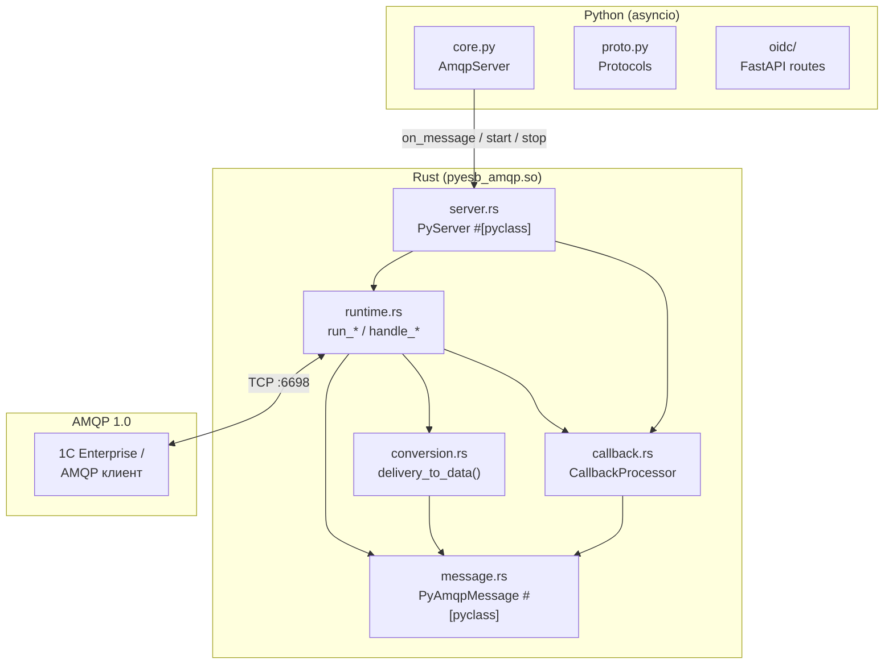
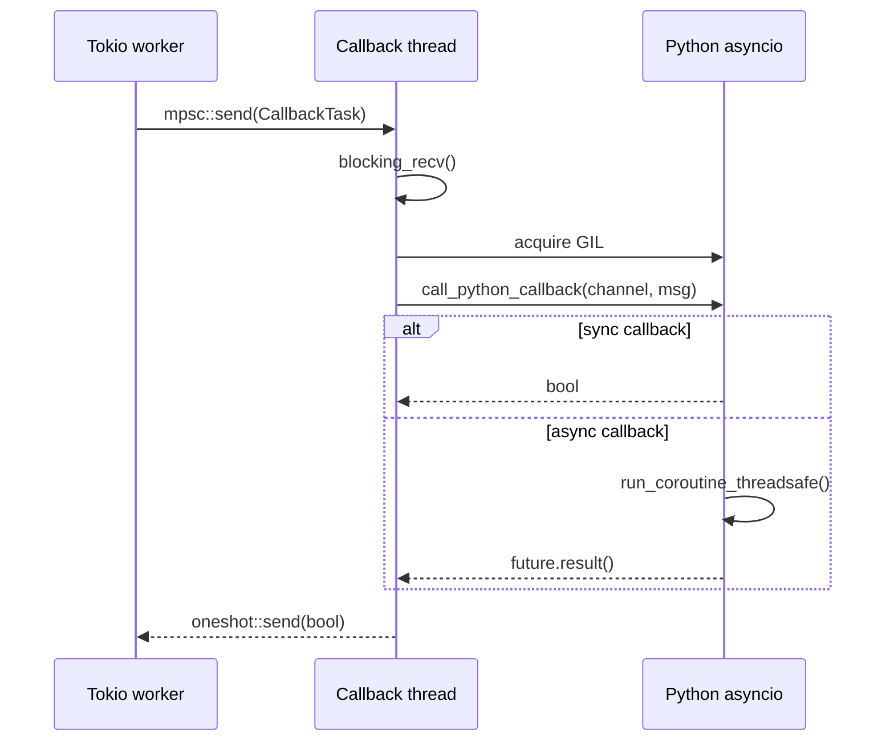
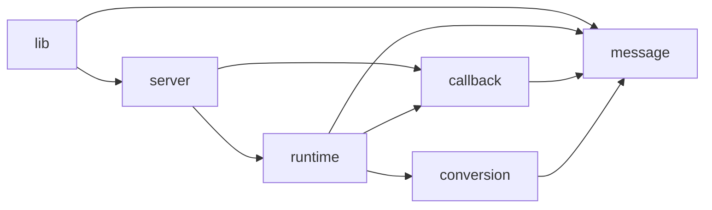

# `src/` — Архитектура pyesb_amqp

**pyesb_amqp** — это AMQP 1.0 сервер, в котором **Rust** делает всю сетевую
работу (приём соединений, парсинг протокола, поток данных), а **Python**
предоставляет бизнес-логику (обработчик сообщений). Связка реализована через
PyO3.



---

## Модули (Rust)

### `lib.rs` — точка входа

28 строк. Единственная задача — объявить дочерние модули и
зарегистрировать PyO3-классы (`#[pymodule]`).

```rust
pub(crate) mod message;
pub(crate) mod conversion;
pub(crate) mod callback;
pub(crate) mod runtime;
pub(crate) mod server;
```

**Зачем:** lib.rs не должен содержать логику — только композицию.
Каждый новый файл сюда добавляется одной строкой.

---

### `message.rs` — PyAmqpMessage (192 строки)

**Смысл:** Rust-представление AMQP-сообщения, которое PyO3 показывает
Python-коду как класс `AmqpMessage`.

```rust
#[pyclass(name = "AmqpMessage", module = "pyesb_amqp")]
pub(crate) struct PyAmqpMessage { … }
```

Поля делятся на две группы:
- **Delivery** — транспортная информация (`delivery_id`, `delivery_tag`,
  `message_format`, `rcv_settle_mode`, `link_output_handle`)
- **Message** — содержимое сообщения (`header`, `properties`, `body`, …)

**Ключевое решение:** сложные AMQP-типы (аннотации, заголовки) разбираются
в плоские `HashMap<String, serde_json::Value>`, а `Properties` — в `PyDict`.
Это сделано потому, что Python-код (Pydantic) должен иметь доступ к полям
через точечную нотацию `msg.properties.message_id`.

**Helper-методы `json_map` / `str_map`:** сериализуют `HashMap` в JSON-строку
и парсят её обратно через `json.loads` на стороне Python. Так мы получаем
нормальный Python `dict`, минуя ручное конструирование `PyDict` для каждого поля.

---

### `conversion.rs` — MessageData + конвертация (194 строки)

**Смысл:** Извлечение данных из AMQP-доставки (`fe2o3_amqp::Delivery`) и
превращение их в промежуточную структуру `MessageData`, которая затем
преобразуется в `PyAmqpMessage`.

```
Delivery<Body<Value>>  ──►  MessageData  ──►  PyAmqpMessage
     (fe2o3-amqp)         (плоская структура)   (pyclass для Python)
```

**Зачем нужна `MessageData`:** чтобы отделить логику парсинга протокола от
логики PyO3-представления. `MessageData` — это просто `struct` с примитивными
полями, без зависимостей от PyO3. Её легко тестировать и модифицировать.

**Функции:**

| Функция | Назначение |
|---------|------------|
| `delivery_to_data()` | Основной парсер. Принимает `&Delivery`, возвращает `MessageData` |
| `header_to_json()` | AMQP `Header` → `HashMap` с полями durable/priority/ttl/… |
| `body_to_bytes()` | AMQP `Body<Value>` → `Vec<u8>` (работает с Data/Value/Sequence/Empty) |
| `extract_properties()` | `ApplicationProperties` → `HashMap<String, String>` |
| `simple_value_to_string()` | AMQP `SimpleValue` → `String` |

**`impl From<MessageData> for PyAmqpMessage`:** автоматическая конвертация
через `.into()`. Позволяет в `runtime.rs` писать:

```rust
let py_msg: PyAmqpMessage = msg_data.into();
```

Вместо ручного перечисления 12 полей. Если в `PyAmqpMessage` добавится поле,
компилятор укажет на `From` — забыть нельзя.

---

### `callback.rs` — CallbackProcessor (180 строк)

**Смысл:** Единственный модуль, который касается Python-потоков (GIL, asyncio).
Содержит тред, в котором вызывается Python-колбэк, и логику sync/async
диспатчинга.

**Ключевое архитектурное решение:** Tokio-воркеры **не должны** захватывать GIL.
Иначе asyncio-цикл в главном Python-треде встанет. Поэтому:

1. Tokio-воркер кладёт `CallbackTask` в `mpsc`-канал
2. Отдельный `std::thread` забирает задачу, захватывает GIL,
   вызывает Python, ждёт результат и шлёт `bool` обратно через `oneshot`
3. Tokio-воркер **await**-ит `oneshot::Receiver` и не блокируется



**Типы:**

| Тип | Смысл |
|-----|-------|
| `SharedCallback` | `Arc<Mutex<Option<Py<PyAny>>>>` — потокобезопасное хранилище Python-функции |
| `CallbackTask` | Задача для треда: `target_address` + `py_msg` + `oneshot::Sender<bool>` |
| `CallbackProcessor` | Сам тред: хранит `mpsc::Sender` и `JoinHandle` |

**`call_python_callback()`:**
1. Создаёт Python-объект `AmqpMessage` из `PyAmqpMessage`
2. Вызывает `cb(channel, msg)`
3. Если результат `bool` — возвращает его (sync callback)
4. Если результат — корутина — диспатчит через `asyncio.run_coroutine_threadsafe`
   и ждёт `future.result()` (GIL отпущен, asyncio может работать)

**Константа `CALLBACK_CHANNEL_CAP = 1000`:** bounded-канал предотвращает
бесконечное накопление задач при медленном Python-обработчике. Когда канал
полон, `task_tx.send(task).await` ждёт — AMQP flow control тормозит
отправителя (backpressure).

---

### `runtime.rs` — run_server / handle_* (229 строк)

**Смысл:** Вся сетевая логика на tokio. Четыре функции, образующие цепочку:

```
run_server()
  └── loop: TCP accept
       └── handle_connection()
            └── session_acceptor.accept()
                 └── handle_session()
                      └── link_acceptor.accept()
                           ├── LinkEndpoint::Sender → warn (не поддерживаем)
                           └── LinkEndpoint::Receiver
                                └── handle_receiver()
                                     └── loop: recv() → delivery_to_data()
                                          → CallbackTask → task_tx.send()
```

| Функция | Ответственность |
|---------|----------------|
| `run_server()` | Bind TCP, listen, shutdown signal, spawn connection handlers |
| `handle_connection()` | Accept AMQP-сессию в рамках соединения |
| `handle_session()` | Accept AMQP-линки (receiver/sender) внутри сессии |
| `handle_receiver()` | Приём сообщений, конвертация, отправка в `CallbackProcessor` |

**Ключевое:** `handle_session` создаёт `LinkAcceptor` с `verify_incoming_target(false)`,
потому что 1С может присылать target с адресами, которые не проходят стандартную
валидацию fe2o3-amqp. Мы всё равно читаем `receiver.target().address` — это
название канала, которое передаётся в Python-колбэк первым аргументом.

**`handle_receiver`** — самое важное место:
1. Получает `delivery` через `receiver.recv::<Body<Value>>()`
2. Читает `target_address` из `receiver.target().address` — это имя канала от 1С
3. Конвертирует доставку в `MessageData` → `PyAmqpMessage`
4. Создаёт `CallbackTask` и отправляет через канал
5. Ждёт результат с **таймаутом 30 секунд**
6. Accept/Reject доставки в зависимости от результата

Таймаут 30с — страховка от зависшего Python-обработчика. Если колбэк не
ответил за 30с, доставка reject-ится, и 1С перешлёт её позже.

---

### `server.rs` — PyServer (210 строк)

**Смысл:** Публичный Python-класс `Server` (`from pyesb_amqp.amqp import Server`).
Единственный `#[pyclass]` на стороне сервера (второй — `AmqpMessage`).

```rust
#[pyclass(name = "Server", module = "pyesb_amqp")]
pub(crate) struct PyServer { … }
```

**Поля:**

| Поле | Тип | Смысл |
|------|-----|-------|
| `host` | `String` | Интерфейс для TCP |
| `port` | `u16` | Порт |
| `container_id` | `String` | AMQP container-id |
| `callback` | `Option<SharedCallback>` | Python-обработчик |
| `callback_processor` | `Option<CallbackProcessor>` | Фоновый тред для вызовов Python |
| `shutdown_tx` | `Option<oneshot::Sender<()>>` | Сигнал остановки для tokio-треда |
| `thread_handle` | `Option<JoinHandle<()>>` | Хендл tokio-треда |
| `loop_ref` | `Option<Py<PyAny>>` | Ссылка на asyncio-цикл Python |

**Методы:**

| Метод | Что делает |
|-------|------------|
| `new()` | Конструктор |
| `on_message(callback)` | Регистрирует Python-обработчик (можно вызвать в любой момент) |
| `set_loop(loop_ref)` | Передаёт ссылку на asyncio-цикл (нужна для async-колбэков) |
| `start()` | Запускает tokio runtime в фоне, блокируется до готовности listener |
| `stop()` | Сигналит остановку, дожидается тредов |
| `__enter__`/`__exit__` | Context manager support |

**`start()` по шагам:**
1. Проверяет, не запущен ли уже
2. Создаёт `CallbackProcessor` (фоновый тред для Python)
3. Запускает tokio runtime в `std::thread::spawn`
4. Блокирует Python-тред до готовности listener (`ready_rx.blocking_recv()`)
5. Если bind не удался — дожидается треда и возвращает `PyException`

**Порядок shutdown-а (важно!):**
1. Сначала `shutdown_tx.send(())` — tokio-тред завершает `run_server`
2. Потом `thread_handle.join()` — ждём завершения tokio
3. Потом `callback_processor.take()` — закрывается канал → тред Python выходит

Это гарантирует, что все незавершённые доставки будут обработаны или
таймаутнуты до остановки callback-треда.

---

## Python-пакет `pyesb_amqp/`

Пакет собирается maturin как часть `cdylib`. Структура:

```
pyesb_amqp/
├── __init__.py    — публичный API (AmqpMessage, AmqpServer, E1CMessage)
├── core.py       — AmqpServer (asyncio-обёртка над Rust Server)
├── proto.py      — AmqpMessage + AmqpMessageHandler (PEP 544 Protocols)
├── models.py     — E1CMessage (Pydantic-модель для сообщений 1С)
├── py.typed      — PEP 561 маркер (типизация для внешних проектов)
└── oidc/
    ├── __init__.py
    ├── core.py   — FastAPI-роуты: /auth/oidc/token, /sys/esb/metadata/channels
    └── models.py — Pydantic-модели OIDC-эндпоинтов
```

### `__init__.py`

Три публичных символа:
- `AmqpMessage` — протокол (интерфейс) сообщения для type hints
- `AmqpServer` — asyncio-сервер
- `E1CMessage` — Pydantic-модель для парсинга входящих сообщений от 1С

### `core.py` — AmqpServer

**Смысл:** asyncio-обёртка над Rust `Server`. Почему не использовать Rust-класс напрямую?

1. **Передача event loop:** `set_loop(get_running_loop())` — нужно для
   `asyncio.run_coroutine_threadsafe`, которым Rust-код диспатчит async-колбэки
2. **Выгрузка stop() в executor:** `stop()` делает `thread::join` — если вызвать
   из asyncio-цикла напрямую, цикл встанет. Поэтому `await loop.run_in_executor(None, server.stop)`
3. **Автостарт в context manager:** если передан `handler`, сервер стартует
   при входе в `async with AmqpServer(handler=handler)`

**Типичный сценарий:**

```python
async with AmqpServer(host="0.0.0.0", port=6698, handler=my_handler):
    await asyncio.Event().wait()
```

### `proto.py` — AmqpMessage & AmqpMessageHandler

Два `@runtime_checkable` Protocol (PEP 544):

- **`AmqpMessage`** — описывает, какие атрибуты есть у сообщения на Python:
  `id`, `delivery_tag`, `body`, `properties`, `durable`, `priority`
- **`AmqpMessageHandler`** — описывает сигнатуру колбэка:
  `async (channel: str, msg: AmqpMessage) -> bool`

`@runtime_checkable` позволяет делать `isinstance(msg, AmqpMessage)` —
полезно для Pydantic.

### `models.py` — E1CMessage

Pydantic-модель, специфичная для 1С Enterprise:

```python
class E1CMessage(BaseModel, extra="allow"):
    body: bytes
    delivery_id: int
    delivery_tag: validator → int.from_bytes
    properties: Properties       # message_id: UUID, creation_time: datetime, …
    application_properties: App  # integ_sender_code, integ_recipient_code, …
    header: Header               # durable, priority, delivery_count, …
```

**Зачем `extra="allow":`** — AmqpMessage от Rust-класса содержит поля,
которых нет в этой модели (например, `message_annotations`). Pydantic
просто игнорирует лишние поля.

### `oidc/` — OIDC-эндпоинты для 1С

**Что это:** 1С Enterprise требует REST-эндпоинты для OIDC-совместимости
(получение токена, метаданных каналов). Это FastAPI-роуты, которые
регистрируются через `add_routes()`:

- `POST /auth/oidc/token` — заглушка (всегда возвращает `Token`)
- `GET /sys/esb/metadata/channels` — возвращает описание каналов
- `GET /sys/esb/runtime/channels` — возвращает runtime-информацию

**Модели:**
- `ChannelDesription` — описание одного канала (process, channel, destination, access)
- `ChannelMetadata` — метаданные для 1С
- `ChannelRuntime` — runtime-статус (сейчас просто порт)
- `Token` — OIDC-токен (заглушка)

---

## Data Flow: полный путь одного сообщения

```mermaid
flowchart TB
    subgraph Network["TCP :6698"]
        client["1С Enterprise"]
    end

    subgraph Acceptor["fe2o3-amqp acceptor"]
        conn["ConnectionAcceptor<br/>SASL Anonymous"]
        sess["SessionAcceptor"]
        link["LinkAcceptor"]
        ep["LinkEndpoint::Receiver"]
        conn --> sess --> link --> ep
    end

    subgraph Receiver["runtime.rs: handle_receiver()"]
        recv["receiver.recv()"]
        target["receiver.target().address<br/>→ target_address (имя канала)"]
        convert["delivery_to_data()"]
        msgdata["MessageData"]
        py_msg["PyAmqpMessage"]
        task["CallbackTask"]
        send_task["task_tx.send(task)"]
        wait["result_rx.await (timeout 30s)"]
        disp{accepted?}
        acc["receiver.accept()"]
        rej["receiver.reject()"]
    end

    subgraph Conversion["conversion.rs"]
        direction LR
        hdr["header → header_to_json()"]
        body["body → body_to_bytes()"]
        ann["annotations → serde_json"]
        props["properties → clone"]
        app["application_properties → extract_properties()"]
    end

    subgraph CB["callback.rs: CallbackProcessor"]
        b_recv["blocking_recv()"]
        lock["callback.lock()"]
        gil["Python::try_attach()"]
        call_py["call_python_callback()"]
        send_result["result_tx.send(bool)"]
    end

    subgraph PythonCB["Python handler"]
        pynew["Py::new → AmqpMessage"]
        invoke["cb.call1(channel, msg)"]
        sync["sync: extract&lt;bool&gt;"]
        async_cb["async: run_coroutine_threadsafe"]
        ret["return bool"]
    end

    client -->|TCP| conn
    recv --> target
    recv --> convert
    convert --> hdr
    convert --> body
    convert --> ann
    convert --> props
    convert --> app
    hdr --> msgdata
    body --> msgdata
    ann --> msgdata
    props --> msgdata
    app --> msgdata
    msgdata -.->|.into()| py_msg
    target --> task
    py_msg --> task
    task --> send_task
    send_task --> b_recv
    b_recv --> lock --> gil --> call_py
    call_py --> pynew --> invoke
    invoke --> sync
    invoke --> async_cb
    sync --> ret
    async_cb --> ret
    ret --> send_result
    send_result --> wait
    wait --> disp
    disp -->|true| acc
    disp -->|false| rej
    acc -->|disposition: Accepted| client
    rej -->|disposition: Rejected| client
```

---

## Ключевые архитектурные решения и их мотивация

| Решение | Почему |
|---------|--------|
| **Tokio в отдельном `std::thread`** | Python (asyncio) не может уступить GIL tokio-воркерам. Только свой тред с отдельным runtime |
| **CallbackProcessor с `mpsc` + `blocking_recv`** | Ни один tokio-воркер не должен захватывать GIL — это заблокирует asyncio |
| **Bounded канал (1000)** | Backpressure: если Python-обработчик медленный, AMQP flow control тормозит отправителя |
| **`MessageData` как промежуточный слой** | Отделяет парсинг протокола от PyO3-представления. Тестировать и менять можно независимо |
| **`From<MessageData> for PyAmqpMessage`** | Компилятор гарантирует, что при добавлении поля в `PyAmqpMessage` нужно обновить и `From` |
| **Таймаут 30с на результат** | Зависший Python-код не блокирует сервер навсегда |
| **sync + async колбэки** | Python-разработчик может писать как `def handler(channel, msg) -> bool`, так и `async def` — Rust разберётся |
| **`verify_incoming_target(false)`** | 1С присылает target в нестандартном формате, но мы всё равно читаем `target.address` как имя канала |
| **OIDC в отдельном пакете** | 1С требует OIDC-совместимости, но это не часть AMQP-сервера. `oidc/` — опциональное расширение |
| **`pyesb_amqp/__init__.py` экспортирует минимум** | Чистый публичный API: `AmqpMessage`, `AmqpServer`, `E1CMessage` |

---

## Зависимости между модулями



Все зависимости направлены **от высокоуровневого к низкоуровневому**.
Нет циклических зависимостей. Каждый модуль импортирует ровно то, что
ему нужно, и не больше.

---

## Быстрый старт для нового разработчика

1. Начать с `server.rs` — это публичный API класса `Server`
2. Понять `callback.rs` — как работает вызов Python из фонового треда
3. Прочитать `runtime.rs::handle_receiver` — основной цикл приёма сообщений
4. Заглянуть в `conversion.rs` — как Delivery превращается в данные
5. Посмотреть `message.rs` — как данные становятся Python-объектом
6. Python-часть: `core.py` → `proto.py` → `models.py`
