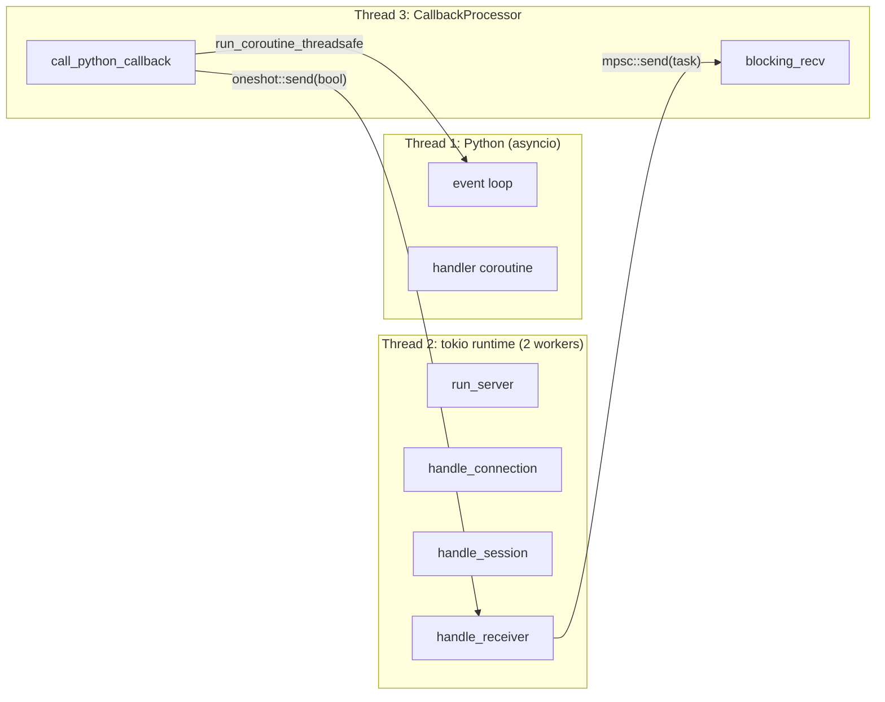
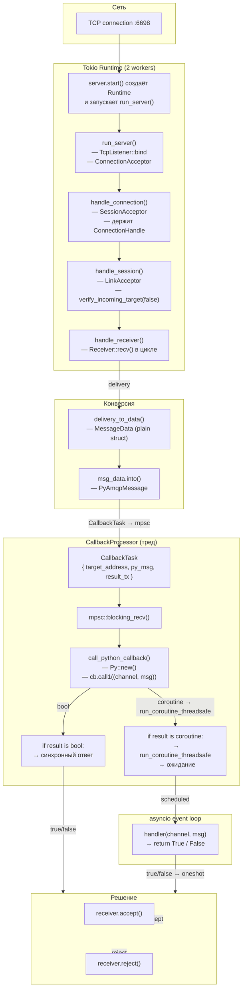
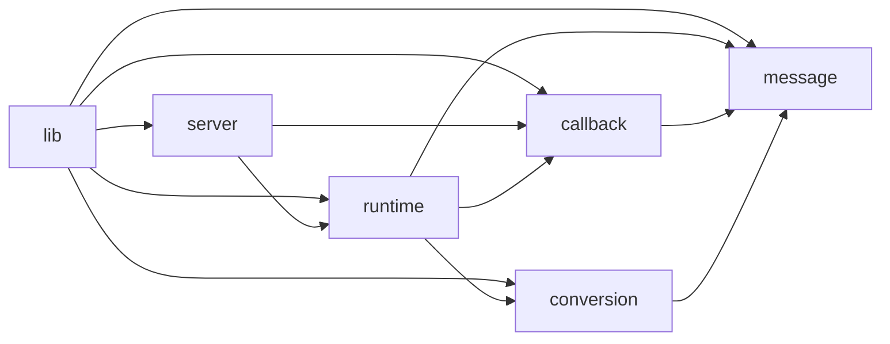

# `src/` — Онбординг Rust-разработчика в pyesb_amqp

> Уровень: средний Rust-разработчик (знает владение, трейты, async/await, но не
> знаком с PyO3 и fe2o3-amqp).
>
> Цель: после прочтения вы сможете уверенно вносить изменения в Rust-код крейта
> и понимать, как он взаимодействует с Python и AMQP 1.0.

---

## 1. Что это вообще такое

**pyesb_amqp** — это AMQP 1.0 сервер, реализованный как Rust-библиотека
(`cdylib`), которая загружается в Python через PyO3. Снаружи это Python-пакет:

```
pip install pyesb-amqp
```

Затем в Python:

```python
from pyesb_amqp import AmqpServer, AmqpMessage

async def handler(channel: str, msg: AmqpMessage) -> bool:
    print(f"[{channel}] {msg.body}")
    return True

server = AmqpServer(port=6698)
await server.start(handler)
```

**Ключевое архитектурное решение:** Rust делает **всю сетевую работу** (TCP,
AMQP handshake, парсинг фреймов, receive loop), а Python получает **уже готовый
объект сообщения** и отвечает `True`/`False`. Обратного вызова из Python в AMQP
нет — это pure consumer.

---

## 2. Структура проекта (Rust-часть)

```
pyesb-amqp/
├── Cargo.toml           # Rust-зависимости
├── pyproject.toml       # maturin-сборка, Python-зависимости
├── src/
│   ├── lib.rs           # Точка входа — модули + #[pymodule]
│   ├── message.rs       # PyAmqpMessage — #[pyclass]
│   ├── conversion.rs    # delivery_to_data() — AMQP → MessageData
│   ├── callback.rs      # CallbackProcessor — тред для Python
│   ├── runtime.rs       # run_server / handle_* — tokio-сеть
│   ├── server.rs        # PyServer — #[pyclass] публичный API
│   ├── pyesb_amqp/      # Python-пакет (обёртка)
│   │   ├── __init__.py
│   │   ├── core.py      # AmqpServer (async start/stop)
│   │   ├── proto.py     # AmqpMessage, AmqpMessageHandler (Protocol)
│   │   ├── models.py    # E1CMessage (Pydantic)
│   │   └── oidc/        # FastAPI-маршруты для 1С
│   ├── README.md        # Архитектурный обзор
│   └── instructions.md  #  <- вы здесь
```

Сборка: `maturin develop --uv` (или `maturin build` для wheel-файла).
`cargo check` тоже работает — проверяет только Rust-часть, без Python.

---

## 3. Три уровня параллелизма (главное — понять это)



| Поток | Назначение | GIL | Что делает |
|---|---|---|---|
| **Python (main)** | asyncio event loop | **Удерживает GIL** | Ждёт корутины от `run_coroutine_threadsafe` |
| **Tokio (2 workers)** | Сеть: TCP, AMQP, receive | **НЕ нужен** | Принимает соединения, парсит фреймы, шлёт задачи |
| **CallbackProcessor (1)** | Python-колбэки | **Захватывает** через `Python::try_attach` | Вызывает handler, кладёт результат в oneshot |

**Почему именно так, а не всё в tokio:**
- PyO3 требует захвата GIL для любого вызова Python
- Если захватить GIL внутри tokio-воркера — **все воркеры встанут** (GIL —
глобальная блокировка)
- Поэтому сделали専ный тред: он блокируется на GIL, а tokio-воркеры работают
параллельно (на 2 ядрах, без GIL)

---

## 4. Data Flow: от TCP-пакета до accept/reject

Вот полный путь одного сообщения, читайте сверху вниз:



**Детали по шагам:**

1. **`server.start()`** (строка 94 в `server.rs`):
   - Забирает `loop_ref` (ссылку на asyncio event loop)
   - Создаёт `CallbackProcessor::new(callback, loop_ref)` — **Thread 3**
   - Создаёт tokio runtime (2 worker-треда) — **Thread 2**
   - Запускает `run_server()` внутри `rt.block_on()`
   - Ждёт `ready_rx` — сигнал, что listener привязан

2. **`run_server()`** (строка 20 в `runtime.rs`):
   - `TcpListener::bind()` — привязка к порту
   - Посылает `ready_tx.send(())` — сигнал, что готов
   - Создаёт `ConnectionAcceptor` с `SaslAnonymousMechanism {}`
   - В цикле: `tokio::select!` между `shutdown_rx` и `listener.accept()`
   - Каждое соединение → `tokio::spawn(handle_connection(...))`

3. **`handle_connection()`** (строка 82 в `runtime.rs`):
   - `SessionAcceptor::default().accept(&mut connection)`
   - Успешная сессия → `tokio::spawn(handle_session(...))`
   - **Важно:** держит `_conn = connection`, чтобы соединение не закрылось,
   пока живёт сессия (см. комментарий про `ListenerConnectionHandle`)

4. **`handle_session()`** (строка 116 в `runtime.rs`):
   - `LinkAcceptor` с `verify_incoming_target(false)` — не проверяем target
   - В цикле принимает линки
   - `LinkEndpoint::Receiver` → `tokio::spawn(handle_receiver(...))`
   - `LinkEndpoint::Sender` → `warn!("not supported — dropping")`

5. **`handle_receiver()`** (строка 154 в `runtime.rs`):
   - **Это сердце библиотеки.** Цикл `receiver.recv::<Body<Value>>()`
   - Извлекает `target_address` из `receiver.target().address`
   - Конвертирует delivery в `MessageData` (через `delivery_to_data`)
   - Превращает в `PyAmqpMessage` (через `msg_data.into()`)
   - Создаёт `CallbackTask` и шлёт через `mpsc::send(task)`
   - Ждёт ответ через `oneshot::Receiver<bool>` с таймаутом **30 секунд**
   - Если `accepted` → `receiver.accept()`, иначе `receiver.reject()`

6. **`CallbackProcessor::new()`** (строка 60 в `callback.rs`):
   - Создаёт **bounded mpsc channel** на 1000 сообщений
   - Запускает `std::thread::spawn` — **odedicated callback thread**
   - В цикле: `task_rx.blocking_recv()` — блокирующий приём из канала
   - Для каждой задачи:
     - `callback.lock()` — захват `Arc<Mutex<Option<Py<PyAny>>>`
     - `Python::try_attach(|py| ...)` — захват GIL
     - `call_python_callback()` — вызов Python-функции
     - `task.result_tx.send(accepted)` — отправка результата обратно

7. **`call_python_callback()`** (строка 142 в `callback.rs`):
   - `Py::new(py, py_msg)?` — создание Python-объекта из Rust-структуры
   - `cb.call1(py, (channel, obj))` — вызов handler(channel, msg)
   - Если результат `bool` → **синхронный handler**
   - Если результат `coroutine` → **async handler**:
     - `asyncio.run_coroutine_threadsafe(coro, loop)` — шедулит на event loop
     - `future.result()` — **блокирует callback thread до ответа**
     - (GIL отпущен во время ожидания, event loop может работать)

---

## 5. Зависимости и ключевые трейты



Циклических зависимостей нет. Порядок (от фундамента к API):

```
message ← conversion ← callback ← runtime ← server
```

- **message** — ни от кого не зависит (кроме PyO3 и fe2o3-amqp-types)
- **conversion** — зависит от `message` (создаёт `PyAmqpMessage` через `From`)
- **callback** — зависит от `message` (оперирует `PyAmqpMessage`)
- **runtime** — зависит от `callback` (шлёт `CallbackTask`), `conversion`
(конвертирует delivery), `message` (для type annotation в `let py_msg:
PyAmqpMessage = ...`)
- **server** — зависит от `callback` (создаёт `CallbackProcessor`), `runtime`
(запускает `run_server`)

---

## 6. Типы и что они означают

### Rust-типы

| Тип | Определён в | Назначение |
|---|---|---|
| `PyAmqpMessage` | `message.rs` | Python-класс `AmqpMessage` (`#[pyclass]`) |
| `MessageData` | `conversion.rs` | Plain struct, промежуточное представление |
| `CallbackTask` | `callback.rs` | Задача для callback-треда |
| `SharedCallback` | `callback.rs` | `Arc<Mutex<Option<Py<PyAny>>>>` — thread-safe holder |
| `CallbackProcessor` | `callback.rs` | Менеджер callback-треда |
| `PyServer` | `server.rs` | Python-класс `Server` (`#[pyclass]`) |

### Python-типы (PEP 544 Protocols)

| Тип | Файл | Назначение |
|---|---|---|
| `AmqpMessage` | `proto.py` | Протокол AMQP-сообщения (duck typing) |
| `AmqpMessageHandler` | `proto.py` | Протокол handler'а `(channel, msg) -> bool` |
| `AmqpServer` | `core.py` | Python-обёртка над `Server` (async start/stop) |
| `E1CMessage` | `models.py` | Pydantic-модель для 1С-формата |

---

## 7. PyO3: что нужно знать

### `#[pyclass]` и `#[pymethods]`

```rust
#[pyclass(name = "AmqpMessage", module = "pyesb_amqp")]
pub(crate) struct PyAmqpMessage { ... }

#[pymethods]
impl PyAmqpMessage {
    #[getter]
    fn body<'py>(&self, py: Python<'py>) -> Py<PyBytes> { ... }

    fn __repr__(&self) -> String { ... }
}
```

- `name = "..."` — как класс будет называться в Python (иначе — имя Rust-типа)
- `module = "..."` — виртуальный модуль для `__module__`
- `skip_from_py_object` — запрещает создание из Python (только из Rust)
- `#[getter]` — Python property (должна принимать `&self` и `py: Python<'py>`)
- `#[setter]` — если нужно разрешить запись
- `#[new]` — конструктор (`__new__` в Python)
- `#[pyo3(signature = (...))]` — задаёт значения по умолчанию для Python

### `Py<PyAny>` — главный тип для ссылок

```rust
// Храним Python-объект (функцию) в Rust-структуре
type SharedCallback = Arc<Mutex<Option<Py<PyAny>>>>;

// Вызываем
cb.call1(py, (channel, obj))?;
```

- `Py<T>` — `Send` но **не** `Sync` (поэтому `Mutex`)
- `Py<PyAny>` — ссылка на любой Python-объект
- `cb.call1(py, args)` — вызывает Python-объект с аргументами
- `Py::new(py, rust_value)` — создаёт Python-объект из Rust-значения (работает
только для `#[pyclass]`)

### GIL — великая и ужасная

```rust
// В callback-треде — захватываем GIL
let outcome = Python::try_attach(|py| -> PyResult<bool> {
    call_python_callback(py, cb, task.target_address, task.py_msg, &loop_ref)
});
```

- `Python::try_attach(f)` — пытается захватить GIL. `None` — не удалось
- `Python<'py>` — доказательство захвата GIL (токен)
- GIL отпускается при выходе из замыкания
- Внутри `call_python_callback` есть `asyncio.run_coroutine_threadsafe` —
она отпускает GIL во время ожидания корутины

### `call1` vs `call_method1`

```rust
// Прямой вызов объекта как функции
cb.call1(py, (arg1, arg2))?;

// Вызов метода на объекте
obj.call_method1(py, "method_name", (arg,))?;
```

### `Bound<'_, PyAny>` — новая API

```rust
// Современная PyO3 API (0.21+)
let result_bound = result.bind(py);
result_bound.extract::<bool>()?;

// Импорт модуля
let asyncio = py.import("asyncio")?;
```

- `result` — `Py<PyAny>` (GIL-independent)
- `result.bind(py)` — создаёт `Bound<'_, PyAny>` (временная привязка к GIL)
- `Bound` — это новая API PyO3 (заменила `&PyAny`)

---

## 8. fe2o3-amqp: acceptor pattern

Мы используем библиотеку **fe2o3-amqp** в режиме **acceptor** (сервер). Ключевые
типы:

```rust
// Connection acceptor — принимает TCP-соединение и проводит AMQP handshake
let connection_acceptor = ConnectionAcceptor::builder()
    .container_id(container_id)
    .sasl_acceptor(SaslAnonymousMechanism {})
    .build();

let mut connection: ListenerConnectionHandle =
    connection_acceptor.accept(stream).await?;

// Session acceptor — создаёт сессию внутри соединения
let session_acceptor = SessionAcceptor::default();
let mut session: ListenerSessionHandle =
    session_acceptor.accept(&mut connection).await?;

// Link acceptor — принимает линки (каналы) внутри сессии
let link_acceptor = LinkAcceptor::builder()
    .verify_incoming_target(false)  // не требовать target
    .build();

let link: LinkEndpoint = link_acceptor.accept(&mut session).await?;

match link {
    LinkEndpoint::Receiver(receiver) => {
        // Клиент шлёт нам сообщения
        loop {
            let delivery = receiver.recv::<Body<Value>>().await?;
            let target_address = receiver.target()  // -> &Option<Target>
                .as_ref()
                .and_then(|t| t.address.as_ref())
                .cloned();
            // ...
            receiver.accept(&delivery).await?;
            // или receiver.reject(&delivery, error)?;
        }
    }
    LinkEndpoint::Sender(sender) => {
        // Клиент хочет получать от нас — не поддерживаем
    }
}
```

**Важные детали:**
- `verify_incoming_target(false)` — 1С может прислать Attach без Target,
не блокируемся
- `SaslAnonymousMechanism {}` — SASL ANONYMOUS, никакой авторизации
- После приёма сессии **нужно держать** `ListenerConnectionHandle` живым —
иначе сессия не сможет отправлять фреймы
- `Receiver::target()` возвращает `&Option<Target>` — это field из Attach-фрейма
клиента
- `Delivery` — одно сообщение. `delivery.message()` — AMQP-сообщение внутри

---

## 9. Bounded channel и backpressure

```rust
// callback.rs
pub(crate) const CALLBACK_CHANNEL_CAP: usize = 1_000;

let (task_tx, mut task_rx) = mpsc::channel::<CallbackTask>(CALLBACK_CHANNEL_CAP);
```

**Зачем bounded:**
- Если Python-хендлер завис (deadlock, бесконечный цикл), unbounded канал будет
  копить сообщения → OOM
- Bounded канал + `task_tx.send(task).await` — если канал полон,
  `handle_receiver` приостанавливается
- AMQP flow control автоматически тормозит отправителя (TCP backpressure)

---

## 10. Oneshot для ответа

```rust
// runtime.rs
let (result_tx, result_rx) = oneshot::channel();

// Отправляем задачу в callback-тред
task_tx.send(CallbackTask { py_msg, target_address, result_tx }).await?;

// Ждём ответ с таймаутом
let accepted = tokio::time::timeout(Duration::from_secs(30), result_rx).await;

match accepted {
    Ok(Ok(true)) => receiver.accept(&delivery).await?,
    Ok(Ok(false)) => receiver.reject(&delivery, ...).await?,
    Ok(Err(_)) => { /* callback тред упал */ }
    Err(_) => { /* timeout 30s */ }
}
```

**Зачем не mpsc для ответа:**
- Каждое сообщение требует ровно один ответ → oneshot идеально (1 producer,
1 consumer)
- Канал самозакрывается при дропе sender/receiver
- Можно `tokio::time::timeout` — страховка от зависшего хендлера

---

## 11. Как добавить новое поле в AmqpMessage

Допустим, нужно добавить поле `group_sequence` (i32) в Python-класс.

### Шаг 1: `message.rs` — добавить поле в `PyAmqpMessage`

```rust
#[pyclass(name = "AmqpMessage", ...)]
pub(crate) struct PyAmqpMessage {
    // ... существующие поля
    pub group_sequence: Option<i32>,  // новое поле
}
```

### Шаг 2: `conversion.rs` — добавить поле в `MessageData` и `From`

```rust
pub(crate) struct MessageData {
    // ... существующие поля
    pub group_sequence: Option<i32>,
}

// В delivery_to_data():
let group_sequence = message.properties.as_ref()
    .and_then(|p| p.group_sequence);

// В From<MessageData> for PyAmqpMessage:
group_sequence: m.group_sequence,
```

### Шаг 3: `message.rs` — добавить getter

```rust
#[getter]
fn group_sequence(&self) -> Option<i32> {
    self.group_sequence
}
```

### Шаг 4: `proto.py` — обновить протокол

```python
class AmqpMessage(Protocol):
    group_sequence: int | None
```

### Шаг 5: `models.py` — обновить Pydantic-модель

```python
class E1CMessage(BaseModel, extra="allow"):
    group_sequence: int | None = None
```

---

## 12. Как изменить сигнатуру callback

Допустим, нужно передавать третьим аргументом `timestamp`.

### `call_python_callback()` — `callback.rs`

```rust
// Было
cb.call1(py, (channel, obj))?;
// Стало
cb.call1(py, (channel, obj, timestamp))?;
```

### `AmqpMessageHandler` — `proto.py`

```python
async def __call__(self, channel: str, msg: AmqpMessage, timestamp: int) -> bool: ...
```

### `core.py` — обновить докстринг

---

## 13. Типичные ошибки и как их избежать

### Забыли про GIL

```rust
// ❌ ОШИБКА: нет Python<'py> — паника!
let result = cb.call1(py, (arg,))?;

// ✅ Правильно: внутри Python::try_attach(|py| ...)
let outcome = Python::try_attach(|py| -> PyResult<bool> {
    call_python_callback(py, cb, task.target_address, task.py_msg, &loop_ref)
});
```

### Py<T> не Sync

```rust
// ❌ ОШИБКА: не скомпилируется
let shared: Arc<Py<PyAny>> = Arc::new(callback);

// ✅ Правильно: Mutex внутри Arc
type SharedCallback = Arc<Mutex<Option<Py<PyAny>>>>;
```

### ConnectionHandle дропнулся раньше сессии

```rust
async fn handle_connection(mut connection: ListenerConnectionHandle, ...) {
    let session = session_acceptor.accept(&mut connection).await?;

    // ❌ connection дропнется здесь — session умрёт
    tokio::spawn(handle_session(session, tx));

    // ✅ connection живёт пока живёт сессия
    tokio::spawn(async move {
        let _conn = connection;  // держим до выхода из замыкания
        handle_session(session, tx).await;
    });
}
```

### Забыли `await` на send() — нет backpressure

```rust
// ❌ ОШИБКА: unbounded send — нет backpressure
let _ = task_tx.try_send(task);

// ✅ Правильно: bounded send + await
task_tx.send(task).await;
```

### Timeout не сработает с blocking_recv()

```rust
// ❌ ОШИБКА: tokio::time::timeout не работает с std::thread::blocking_recv
tokio::time::timeout(Duration::from_secs(30), task_rx.blocking_recv()).await;

// ✅ timeout ставится на стороне tokio, на oneshot receiver
let accepted = tokio::time::timeout(
    Duration::from_secs(30),
    result_rx,  // это tokio::sync::oneshot::Receiver
).await;
```

---

## 14. Режим отладки

### Логи (stderr)

Tracing настроен в `server.rs`:

```rust
tracing_subscriber::fmt()
    .with_writer(std::io::stderr)
    .try_init()
    .ok();
```

Логи идут в stderr (не в stdout, чтобы не мешать Python-выводу). Чтобы увидеть:

```bash
python my_script.py 2>&1 | grep amqp
```

Все ключевые точки логируются:
- `info!("Bound to {addr}")` — listener готов
- `info!("Incoming connection from {peer_addr}")`
- `error!("Python callback raised: {e}")` — ошибка в handler
- `error!("Callback thread unavailable — rejecting message")` — канал переполнен
- `error!("Python handler timed out after 30s — rejecting message")` — timeout

### cargo check

```bash
cargo check                   # только Rust, быстро
maturin develop --uv          # собрать + установить в venv
maturin build --release       # собрать wheel
```

### cargo test

Сейчас тестов нет — только smoke-тесты на Python. Если добавляете новую
функциональность, пишите тесты в `tests/` или Python-скрипты проверки.

---

## 15. Миграции и обратная совместимость

Крейт — `cdylib`, публичного Rust API нет (все модули `pub(crate)`).
Python-интерфейс — единственный контракт.

**Правила:**
- Добавление полей/методов — безопасно (Python duck typing)
- Изменение сигнатуры `AmqpMessageHandler` — **breaking change** (commit
`3751a5c` показал это)
- Для обратной совместимости можно принимать `**kwargs` или делать поле
опциональным

**Как правильно менять сигнатуру callback:**
1. Обновить `call_python_callback()` в `callback.rs`
2. Обновить `AmqpMessageHandler` в `proto.py`
3. Обновить докстринг `core.py`
4. Написать release notes
5. Обновить примеры и тесты

---

## 16. Как собрать и запустить

```bash
# 1. Создать venv
uv venv
source .venv/bin/activate

# 2. Установить maturin
uv pip install maturin

# 3. Собрать и установить
maturin develop --uv

# 4. Проверить
python -c "from pyesb_amqp import AmqpServer; print('OK')"

# 5. Запустить тест
python -c "
import asyncio
from pyesb_amqp import AmqpServer

async def handler(channel, msg):
    print(f'[{channel}] Got {msg.body}')
    return True

async def main():
    s = AmqpServer(port=6699)
    await s.start(handler)
    await asyncio.sleep(2)
    await s.stop()

asyncio.run(main())
"
```

---

## 17. Куда смотреть, если что-то пошло не так

| Симптом | Где искать |
|---|---|
| Не стартует listener | `ready_rx.blocking_recv()` в `server.rs` строка 159 |
| Connection refused | `TcpListener::bind()` в `runtime.rs` строка 29 |
| "Failed to acquire GIL" | `Python::try_attach()` в `callback.rs` строка 76 |
| "Python callback raised" | `call_python_callback()` в `callback.rs` строка 90 |
| "timed out after 30s" | `tokio::time::timeout` в `runtime.rs` строка 193 |
| "Callback thread unavailable" | `task_tx.send(task)` в `runtime.rs` строка 183 |
| Пустой channel | `receiver.target().address` = None → строка 163 в `runtime.rs` |
| 1С не подключается | `connection_acceptor.accept()` — SASL? порт? |
| 1С подключился, нет сообщений | `link_acceptor.accept()` — target verification? |

---

## 18. Что почитать для углубления

| Тема | Где |
|---|---|
| AMQP 1.0 spec | <https://docs.oasis-open.org/amqp/core/v1.0/os/amqp-core-transport-v1.0-os.html> |
| fe2o3-amqp | <https://github.com/grevinden/fe2o3-amqp> |
| PyO3 user guide | <https://pyo3.rs> |
| tokio | <https://tokio.rs> |
| maturin | <https://www.maturin.rs> |
| Протокол 1С:Шины | <https://v8.1c.ru/platforma/shardy/adaptivnye-servisnye-moduli/> |

---

## История изменений документа

| Дата | Изменение |
|---|---|
| 2026-06-23 | Первая версия |
